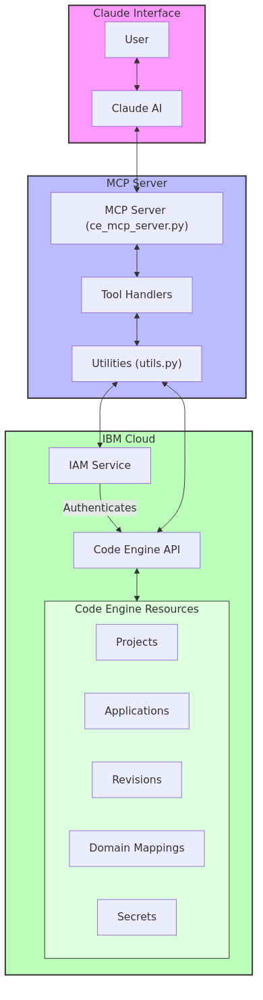

# IBM Code Engine MCP Server

A Modular Content Processing (MCP) server for interacting with IBM Code Engine resources through Claude. This server provides tools for listing and managing Code Engine projects, applications, and related resources.

## Overview

This MCP server enables Claude to directly interact with IBM Code Engine services by providing a set of tools for listing projects, applications, and viewing detailed information about your Code Engine resources. The server is designed to be run as a standalone service or in a Docker container.



## Installation

### Prerequisites

- Python 3.10+
- IBM Cloud API key with access to Code Engine services
- Docker (optional, for containerized deployment)

### Setup

1. Clone this repository
2. Install dependencies:

```bash
# Create a virtual environment (optional but recommended)
python -m venv .venv
source .venv/bin/activate  # On Windows: .venv\Scripts\activate

# Install dependencies
pip install -r requirements.txt
```

## Usage

### Running Locally

1. Set your IBM Cloud API key:

```bash
export IBMCLOUD_API_KEY="your-api-key-here"
```

2. Run the server:

```bash
python ce_mcp_server.py
```

### Running with Docker

1. Build the Docker image:

```bash
docker build -t ibm-code-engine-mcp .
```

2. Run the container:

```bash
docker run -d \
  --name code-engine-mcp \
  -e IBMCLOUD_API_KEY="your-api-key-here" \
  --restart unless-stopped \
  ibm-code-engine-mcp
```

### Using with Mise

If you have [Mise](https://github.com/jdx/mise) installed, you can use the provided tasks:

```bash
# Install dependencies
mise run uv:reqs

# Run tests
mise run test:ce-client

# Build Docker image
mise run docker:build

# Run Docker container
mise run docker:run
```

## Available Tools

The MCP server provides the following tools:

1. **list_projects** - List all IBM Code Engine projects in your account
2. **list_applications** - List applications in a specific Code Engine project
3. **get_application** - Get detailed information about a specific application

## Project Structure

- `ce_mcp_server.py` - Main MCP server implementation
- `utils.py` - Utility functions for Code Engine client
- `Dockerfile` - Docker container definition
- `healthcheck.py` - Health check script for Docker
- `test_ce_client.py` - Test script for Code Engine client
- `test_mcp_imports.py` - Test script for MCP library imports
- `tests/` - Directory containing pytest test cases

## Configuration

The server can be configured using the following environment variables:

- `IBMCLOUD_API_KEY` (required) - Your IBM Cloud API key
- `IBMCLOUD_REGION` (optional, default: "us-south") - IBM Cloud region
- `LOG_LEVEL` (optional, default: "INFO") - Logging level (DEBUG, INFO, WARNING, ERROR)
- `MCP_SERVER_NAME` (optional, default: "ibm-code-engine-mcp") - Name of the MCP server
- `MCP_SERVER_FILE` (optional, default: "ce_mcp_server.py") - Server file to run in Docker

## Testing

See the [Testing Guide](docs/testing.md) for information on running and creating tests.

## Development

For development, it's recommended to use the provided Mise tasks:

```bash
# Set up development environment
mise run dev

# Run code quality checks
mise run quality

# Test Code Engine client
mise run test:ce-client
```

### Pre-commit Hooks

This project uses pre-commit hooks to ensure code quality and security. See the [Pre-commit Guide](docs/pre-commit.md) for setup instructions.

## Troubleshooting

If you encounter issues, try the following:

1. Check your IBM Cloud API key is valid and has the necessary permissions
2. Verify your Python environment has all required dependencies
3. Run the test scripts to diagnose potential issues:

```bash
# Test Code Engine client
python test_ce_client.py

# Test MCP library imports
python test_mcp_imports.py

# Run pytest tests
pytest
```

## Architecture

The MCP server integrates with Claude and IBM Cloud services as shown in the architecture diagram:

### Architecture Components

1. **User & Claude Interface**:
   - User requests information about IBM Code Engine resources
   - Claude processes these requests and calls the appropriate MCP tools

2. **MCP Server**:
   - Handles tool calls from Claude
   - Manages the routing of requests to appropriate handlers
   - Formats responses for Claude to present to the user

3. **Utilities**:
   - Authenticates with IBM Cloud using IAM
   - Makes API requests to Code Engine services
   - Processes and formats response data

4. **IBM Cloud**:
   - Validates authentication via IAM
   - Processes Code Engine API requests
   - Returns resource data from Code Engine projects, applications, etc.

### Data Flow

1. User requests Code Engine information from Claude
2. Claude makes tool calls to the MCP server
3. The server routes requests to appropriate handlers
4. Handlers use utility functions to interact with IBM Cloud
5. The Code Engine API returns resource data
6. Data is processed, formatted, and returned to Claude
7. Claude presents the results to the user

This architecture enables seamless integration between Claude and IBM Code Engine resources, allowing users to query and manage their resources directly through the Claude interface.
