```mermaid
flowchart TB
    Start[Start Testing] --> Setup{Setup Complete?}
    
    Setup -->|No| Step1[1. Build Docker Image]
    Step1 --> Step2[2. Create .mcp.env file]
    Step2 --> Step3[3. Configure Claude Desktop/Code]
    Step3 --> Step4[4. Restart Claude]
    Step4 --> Setup
    
    Setup -->|Yes| Test1[Test 1: List Projects]
    
    Test1 --> Check1{Projects Listed?}
    Check1 -->|No| Debug[Check Troubleshooting Guide]
    Debug --> Test1
    Check1 -->|Yes| Test2[Test 2: Deploy Pre-built Image]
    
    Test2 --> Check2{App Deployed?}
    Check2 -->|No| Debug
    Check2 -->|Yes| Test3[Test 3: Check App Status]
    
    Test3 --> Check3{Got Endpoint?}
    Check3 -->|No| Debug
    Check3 -->|Yes| Advanced{Try Advanced?}
    
    Advanced -->|Yes| BuildFlow[Build & Deploy Workflow]
    BuildFlow --> CreateBuild[Create Build Config]
    CreateBuild --> RunBuild[Execute Build Run]
    RunBuild --> Monitor[Monitor Build Status]
    Monitor --> Deploy[Deploy Built Image]
    Deploy --> Verify[Verify Deployment]
    Verify --> Success[✅ Complete!]
    
    Advanced -->|No| Success
    
    Success --> More{More Testing?}
    More -->|Yes| Test1
    More -->|No| Done[🎉 Ready for Production!]
    
    style Start fill:#e1f5ff
    style Success fill:#d4edda
    style Done fill:#d4edda
    style Debug fill:#f8d7da
```

# Testing Flow Diagram

This diagram shows the complete testing workflow for the IBM Code Engine MCP Server.

## Phase 1: Setup (One-time)
1. **Build Docker Image** - Package the MCP server
2. **Create Environment File** - Store your IBM Cloud credentials
3. **Configure Claude** - Set up MCP server in Claude Desktop/Code
4. **Restart** - Apply configuration changes

## Phase 2: Basic Tests
1. **List Projects** - Verify authentication and connectivity
2. **Deploy Pre-built** - Test basic deployment functionality
3. **Check Status** - Verify you can query deployed apps

## Phase 3: Advanced Tests (Optional)
1. **Create Build Config** - Set up source-to-image pipeline
2. **Execute Build** - Build container from source
3. **Monitor Status** - Track build progress
4. **Deploy** - Launch the built application
5. **Verify** - Confirm everything works

## Debugging
If any step fails, check the troubleshooting guide for:
- Docker connectivity issues
- API authentication problems
- Network timeouts
- Build failures
